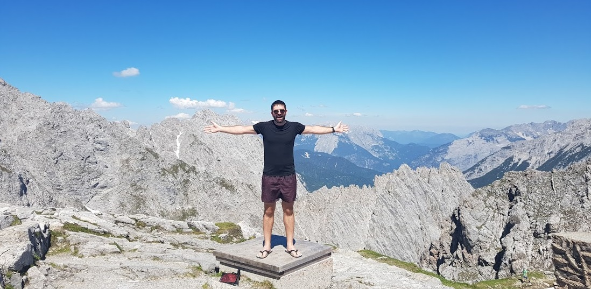

Hi, I’m Darragh. I’m a full stack web developer and people leader from Cork, Ireland. I’ve been writing apps for a decade. On the client, then on the server and now on the client again.

### Digital // Teams // Learning

I studied applied physics at Cork Institute of Technology. After that I moved to Canada to work for Blackberry (1 year after Apple opened the App Store and there was still hope!).

I grew tired of winter after four years in Ontario , I traveled for a while – I cycled through Africa, visited friends in Europe and drove across Canada and up to the Arctic Circle. I eventually landed in New Zealand.

I love to try new things, see new places and meet new people. I’m particularly fond of the mountains, the oceans and outdoor places. I’ve never stopped playing with Lego.

In general I’d rather be on my paddle board.

I was lucky enough to have access to a computer early through my school and eventually my family got a computer. I grew up breaking and rebuilding PC’s, running IRC daemons and messing around on the internet in general. I love it.

I drive my motorcycle most days. I love cycling on longer trips. I drive a car when I need to get boards to the surf.

I bloody love chocolate. I drink reds generally. I don’t like salad dressing.