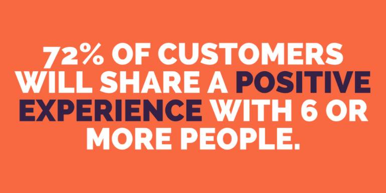

## The Story

I created this course based on my experience running [The Customer Workshop][3] . A friend requested some information on how we organised it and I've wanted to try creating a course on the teachable platform since hearing about it on Side Hustle School.

You can check out the course for FREE! here: https://fuzzyminds.teachable.com/p/the-customer-workshop

## The Details

The customer workshop is a week long event for forging incredible relationships between product delivery teams and their customers.

You'ill invite customers in to your workplace for an entire day, you'll work with them to identify how you can help them and then for the rest of the week you'll work to solve those problems.

This course is a D.I.Y. guide for running your own customer workshop. I will provide you all the checklists you need to ensure you don't forget anything and promotional materiel to sell the idea to your team and your leaders.

You will save anywhere up to 6 weeks of planning by following my course.

If you want your customers to feel…

* that you care deeply about their business and their problems.
* that you are competent and understand their business.
* that you provide value for money.

If you want the developers in your team to have…

* increased empathy for your customers by associating their work with real people rather than personas.
* a chance to hack and hustle to get shit done outside of their structured day-to-day agile practice.

…then you will benefit from this course!

## The Course

You can check out the course for FREE! here: https://fuzzyminds.teachable.com/p/the-customer-workshop