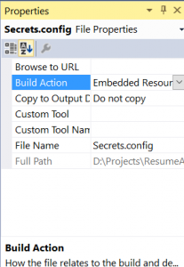
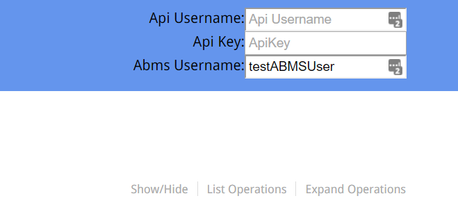
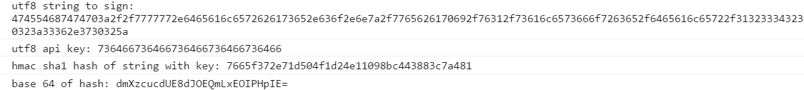

Last year I launched a new API for an integration project. It's using Microsoft's WebApi framework. I was looking for a fast way to document the API so I wouldn't have to do much work and clients could use the API easily. After some research it was obvious that I needed Swagger.

## Swagger

Swagger () is an open source framework that makes it really easy to design, build and document APIs. At it's core, it's a specification for describing APIs. Once you have an API documented in swagger you get access to a huge number of free tools. There are tools available for automatically generating clients on rails, iOS, node, angular or Android and it has tools for generating detailed html documentation right off of your specification.

## Swashbuckle

Swashbuckle () is an awesome wrapper around some of the swagger tools for .Net WebApi projects. You can just install it from nuget package manager. After installing, if you visit https://your-api.com/swagger you will see the resulting documentation. There are loads of options to make the documentation better and describe your API, mostly using attributes and XML comments on the controllers and models.

## The hmac authentication problem

Swagger-ui supports HTTP Basic Authentication and OAuth2. Our API supports a cookie token authentication and it allows some endpoints to be accessed using an HTTP request hashing authentication based on Amazon Web Services (http://docs.aws.amazon.com/AmazonS3/latest/dev/RESTAuthentication.html). I needed to find a way to get swagger-ui to accept the credentials from the user, hash the details of the request and finally add the hash in to some headers we read on the server.

It took a bit of trial and error and some investigation to figure it out so I want to share it here.

## Adding custom javascript and css to the swagger-ui page

You can inject css and javascript files onto the swagger-ui index using the swashbuckle configuration as you can see below. You just need add them in the configuration section as below.

I use moment.js to handle datetime manipulation in javascript – used for getting UTC time in ISO 8601 format. enc-base64, sha256 and hmac-sha1 are all from Google's CryptoJS project. You can get them here: . Import them using whatever module loader you prefer.

The content files must be set to Build Action: Embedded Resource in your .Net solution. Then you refer to them in the configuration using their resource names which is basically AssemblyName.Folder.Path.Filename.js.

https://gist.github.com/darraghoriordan/bf090758e210d18356b57f4006d65876#file-swaggeruiconfig-cs

The custom index.html is just used to set some titles. You should change the custom.html as little as possible so you can easily upgrade to the next version of Swashbuckle or swagger.

## Overriding the swagger authentication

Everything for the HMAC authentication is done in apihmacheaderauth.js. The swagger-ui library exposes an authorizations pattern that gives you access to the HTTP request context and all of it's properties as you can see below. I've over commented and consoled just for this tutorial.

This file adds some custom headers for authentication and authorization based on Amazon's hmac pattern for AWS. I'll get in to why I chose to do this in another post. In retrospect it was too heavy handed for sure. It also has to use custom headers rather than the Authorization header to lazily support multiple Authentication scenarios with precedence. Sorry about the lack of indentation, it got destroyed by wordpress.

https://gist.github.com/darraghoriordan/338b60eaac3693a24b67ad5f26b79263#file-swhmac-groovy

Here are the new fields on my index page that replace the HTTP basic authentication for swagger

And here is the console output of the HMAC authentication when I try to make a request

That's it! I hope it helps you.