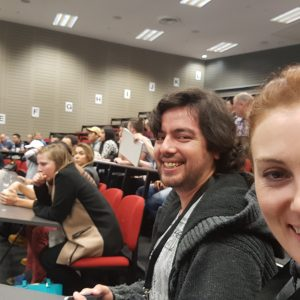
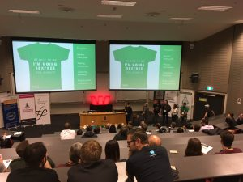

Wow, it's a week after Startup Weekend Auckland. I've had time to get my thoughts straight about the whole experience. I learned a hell of a lot of positive lessons about idea validation, about myself and about working in teams.

## Friday Night

We started the event on Friday night with a brief introduction to the format and some key organizers. Thirty enthusiastic 60 second pitches quickly followed. There were ideas for B2B services, tournament platforms, monetizing Facebook, recipes and shopping.

Andres and Billie Friday night

The problem that resonated with Billie, Andres and I was presented by Steffi who spoke about infertility and how it could be reduced with simple education. I was interested because I know a family that is affected by infertility and it was the only idea that wasn't immediately commercial.

After the pitches we went out to meet Steffi and ask her if she would like to have us on her team. Our team was quickly joined by Andy who works in property and Ally who works in marketing. By the end of the voting we had a very well rounded team.

We stayed at the event until 1am Friday night researching the idea. We learned about existing solutions and tried to figure out which part of the huge demographic we would try to target. It was a productive evening learning about the problem.

## Saturday

We got to the second day and immediately got in to working out an informational site. We got strongly challenged by the mentors about not thinking through the greater problem.

We got some great feedback on the first pitch. One mentor warned that saying "ins and outs" may cause laughter issues" – We would turn this in to a positive by the final pitch.

Re finances – "If you can only crowdfund $3,000 in the first year no one gives a shit". I didn't think this way before the weekend but it's so true. $3,000 these days isn't much at all.

Another mentor said we should have more optimism – "What beyond a website would help these people?". This really resonated with me and got me thinking that an informational website wasn't a great idea.

Some problems started to develop in our group. There were passive aggressive comments around the table and it was a terrible environment. I found it very difficult to confront strangers. This made me realize how great it is to work in such an honest, direct workplace at Trade me.

> Lesson 1 – There's no time for bullshit, be honest and up front

At around 3pm on Saturday I lost passion for the informational site. I felt like any criticisms of it weren't being listened to so I decided to use the time to learn some technology and just settled in to coding a template Billie had designed.

> Lesson 2 – The person who pitched doesn't own the idea any more, give up your plan and let the idea evolve

Our second pitch didn't go very well because we had run out of energy and enthusiasm. The judges called us out on it and we all felt pretty miserable coming out. We left at 11pm absolutely drained, physically and emotionally.

There were some wonderfully positive outcomes from Saturday. I learned about the fertility problem in general and I learned I could work well with Billie.

## Sunday

I started the last day feeling a bit apprehensive about the whole weekend but Steffi had really opened up to changing the plan and the rest of the team were keen too.

We went back to basics and started an ideation session in one of the lecture theaters. I had some ideas but mostly I just kept firm about the not so good ideas that were being bandied about. We came up with a range of ideas but didn't settle on one for the morning pitch. It was really hard tearing up everyone's ideas but I'm glad I did to get us where we eventually got to.

Andy gave a great pitch on what we had done for the whole morning and where we were going with ideas. The mentors saw that our energy was back and helped us out by giving us the Logic Model.

We used this model and realized we would have a better impact by focusing on young people. We argued back and forth about what to actually build while hanging out around a table outside. There were sperm iOS games and egg tamogotchi ideas. After lots of thinking we thought of a Movember clone – a month of no sex and named it Sexless September.

I thought this was an awesome idea and felt I had been negative enough all morning so after one final argument with Steffi to not have too much information on a Movember type site I checked out and got some lunch.

The team was buzzing again and I quickly built a site that Billie had designed in square space. I was surprised how awesome and easy squarespace is.

> Lesson 3 – Persevere, It will come together at the end

We pulled it together by the end. We announced the new site on our Facebook pages and got 60 or so signups to our email list by the end of the weekend.

Steffi and Andy gave an incredible pitch. It started off quite somber and then Andy brought in the humorous side. What really struck me was the audience was our intended target audience and they LOVED it. Billie's tee shirt idea went down a treat.

Giving the final pitch

So overall the weekend was like a roller-coaster. It started high with a surprise not for profit project, dropped very low on Saturday, climbed Sunday morning with our ability to change output, dropped off again for me having to be negative to focus the output and finally finished on a super high because of where we got to.

I would highly recommend going to a startup weekend. It opened my eyes to many more of the factors involved in building a product. The mentors were awesome. Our team was awesome and the problem we had to solve was awesome. It was organised very well. It was a pressure cooker but I came out better for having gone.