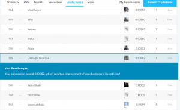
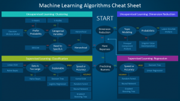
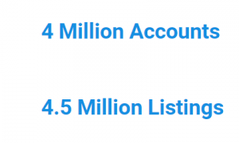
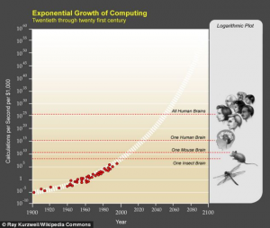

Last week I had an amazing opportunity to present about machine learning and innovation to 110 people leaders at my company. It was a mixed audience of technical and non technical people.

My message is that machine learning needs to be understood by everyone in the business, not just the data scientists. Domain knowledge with machine learning will really enable successful data projects.

Here are my slides and some notes

A few months ago I followed a tutorial on http://course.fast.ai and entered a Kaggle.com competition. The competition problem was to label 20,000 images of cats and dogs using computer vision. There were 1300 entries from around the world.

I downloaded an existing, freely available algorithm – vgg16 and slightly modified it to get 87% accuracy.

I thought this was a great result. It's REALLY hard for computers to tell what is in these pictures. 5 years ago a team of scientists got 57% accuracy with this same dataset.

However it turns out I didn't do very well:) I came 600th! The winners got closer to 97% accuracy.

We'll never all be data scientists but the technology is at a point where anyone new to machine learning can download great solutions and start solving these problems. You as domain experts are in the best place to see these opportunities and start experimenting.

What is machine learning and why is different to what we do now? This is very simplistic but with traditional computing we would tell the computer exactly what result we wanted for a given set of inputs. With machine learning we give the computer a large amount of information and we ask the computer to give us insights in to the data.

We don't write explicit programs. The 'program' is an output from the data and will change based on the data.

It does this using some well known and well studied mathematics. Data scientists even have a cheat sheet for which algorithm to use. For more difficult aspects of machine learning like Deep Learning, there are some very good models available for free online. I downloaded one of these for cats and dogs.

But we're not here to learn the cheat sheet so forget about the detail.

Just remember that the algorithms are well known for a given problem.

What gives companies an advantage in machine learning is their data.

We have an incredible set of users here. And they're giving us some great data. Crunching all this data costs money.

One of the reasons you hear a lot about machine learning recently is that computing power has gotten very cheap. I spent just $150 for a few hours of computing from amazon for cats and dogs.

Why now? Exponential innovation…

Every few years for the past 100 years the amount of computing power you can buy for $1000 dollars has doubled. We are just at the tail end of the most recent technology advance – semi conductors. This pattern means that right now for roughly $1000 dollars you can purchase the same amount of computing power as a mouse's brain.

If this trajectory continues then by 2024 for that same $1000 dollars you will be able to purchase the same amount of computing power as the human brain.

Now this is a wacky idea and I don't believe it myself. But that's perfectly normal! Humans are really bad at thinking exponentially.

If I ask you to walk 30 steps linearly then that's easy to picture, 30 meters. However if I ask you to walk 30 steps exponentially, doubling every step – 1m, 2m, 4m, 8m. Then by the 30th step you will step billions of meters. The final step will take you 26 times around the world!

We can't think this way but this is how fast and how cheap computers are becoming.

There are three things we can do to help accelerate adoption of machine learning throughout the business.

Realize that machine learning is absolutely accessible and it's not magic once you know what types of problem can be solved.

There are 5 major types of problem…

Classification

Regression

Clustering

Ranking

Anomaly Detection

Think about problems in your part of the business that can be phrased this way.

We need to collect better data, not just more data. We need to collect relevant data and this is where your domain knowledge is vital.

You are also in the perfect position to identify gaps in our current data. We should find these as soon as possible and start plugging them.

We need to identify any possible external sources of data, council data for example.

You should identify areas of the business where we are making subjective decisions. If we can eliminate ambiguity and subjective decisions from the business we can make better decisions.

Collaborate with data scientists – your domain knowledge combined with the skills of our data science is what will produce the best results

Don't silo data. ask your data team where you should push data so everyone in the business can access it.

Don't be afraid of sensitive data. We can anonymise the data and still get great insights from it.

We have some slack channels. Anyone can join the channels. We are all learning and these are a safe space for any level of knowledge in machine learning.

We will be running classes ranging from this type of over view information all the way to implementing real solutions.

So don't be afraid of machine learning. Here we have a huge loyal user base and they're generating amazing data, we have a group of the top technical and business talent in the country.

But our industry is changing faster than we can imagine and we need to use every tool available to keep our advantage in the future.

Think of machine learning as another technology or tool like Word, Excel or Photoshop. Learn about it. Get involved.

Please get in touch if you would like more information.

Some images from this amazing article on wait, but why: http://waitbutwhy.com/2015/01/artificial-intelligence-revolution-1.html

The slides and idea for exponential innovation from this great talk by Kaila Colbin: https://www.youtube.com/watch?v=XwxwVSJcOGU

Course: http://course.fast.ai
