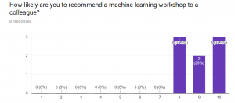
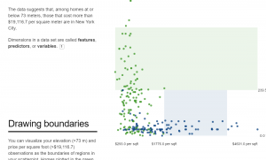
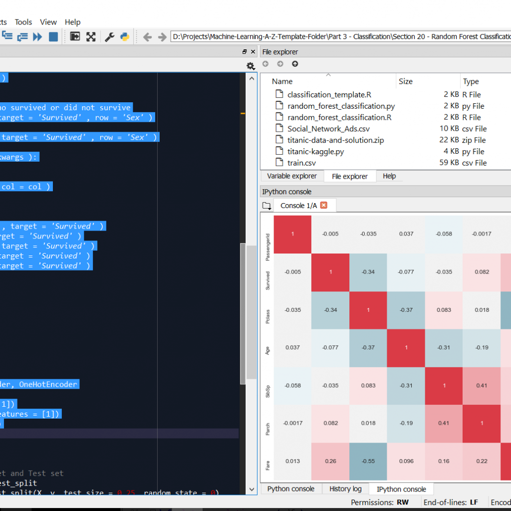

Last week I offered to give a workshop on machine learning to share some of what I’ve learned so far. I had 2 goals for my workshop – first, I wanted to show everyone that they shouldn’t be afraid of machine learning. Second, I wanted to get people set up with anaconda so they can continue to learn themselves.

I had a cross functional group of ~10 colleagues – business analysts, data analysts, UX designers, developers and test analysts. It went quite well! Everyone seemed engaged for the hour we spent together. I ran a survey after the workshop and achieved an NPS of 63!

If you want to give a machine learning workshop please feel free to use this a template. I used resources already available online for my workshop. I only made some small changes and I have included all the links and files below.

SOME LESSONS FOR YOU TO APPLY
As a facilitator I wouldn’t recommend having more than 12 attendees.
Be very clear on what you’re going to cover at the start
If you have time, pick a problem in your work domain. But don’t sweat if you can’t.
Use visual learning tools. There are some great ones for decision trees and random forests.
Don’t make people write code the first time out. Just have them execute lines.
THE PROCESS
 

INSTALL ANACONDA
Before the workshop, I asked everyone to install Anaconda on their computers from https://www.continuum.io/downloads. I decided to use python because it’s what our data team use and enables future model sharing.

EXPLAIN THE ALGORITHM
I spent maybe 20 minutes explaining decision trees with NO MATH using the incredible visualizations on http://www.r2d3.us/visual-intro-to-machine-learning-part-1/. This page is beautiful and self explanatory.

DOWNLOADING THE FILES
I used a popular titanic data set from kaggle.com. I only used the training set for both training and testing to keep it simple. You can download the files here: https://www.darraghoriordan.com/wp-content/uploads/2017/06/titanic-data-and-solution-2.zip

RUN THROUGH THE CODE
I used an excellent kernel from https://www.kaggle.com/helgejo/an-interactive-data-science-tutorial. I simplified it by only using three features for my model. Some of my visualizations are from super data science’s machine learning A-Z course.

With all this in place I just asked people to open Spyder from Anaconda. They had to set the working directory to where they had unzipped the files and restart the kernel.

Then we stepped through each section together. We talked about all the visualizations and results.

I really tried to stress that training the model is easy but understanding and preparing the data is difficult.

 

I got some great feedback on the machine learning workshop. Some attendees wanted to stay longer to get better accuracy and learn more algorithms!

One person wanted a problem more closely related to our work so I’m going to do that next time.

If I had more time I would try to form groups and have them compete to get the best accuracy. As facilitator I would be walking around trying to help them out individually. Instead this was ‘homework’.