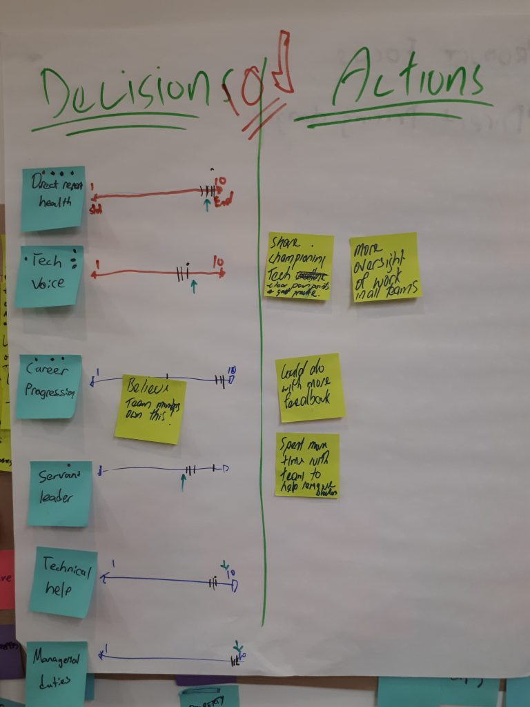

A.k.a. how to get the truth from your direct reports while you sit back and eat cake.

You’ve been a manager for a year and you’re not sure it’s all going OK? You don’t know if you’re providing maximum value to your team or which specific aspects of your people leadership to improve?

You might be having regular catch ups but you’re not receiving honest leadership feedback, or maybe you’re getting it but you’re just not hearing it!

In Kim Scott’s  she suggests having a feedback session where your team and YOUR manager catch up WITHOUT YOU being present.

I thought this was a fantastic idea and my team tried it out last week.

### Setting up participation mode
I booked an hour with our awesome agile coach Scott Nepia, my manager and my team. The agenda was roughly:

10 mins – intro and break down
20 mins – Describe what you expect from a perfect manager
20 mins – How does your manager’s performance rank for each these things at the moment
10 mins – Wrap up

One of the nice things about this process is I just went and had cake while my team did all the work themselves.

A GREAT TEAM LEAD IS…
Scott asked the team members to write down the responsibilities they think a chapter lead has in our organisation.

We use a version of the Spotify model at Trade Me. We call practice leads “Chapter Leads”. We have self-organizing, self-contained teams called “Squads”. Each squad is roughly 2 developers, one BA, one tester, one designer and one product owner.

I’m a development chapter lead and I manage developers in 4 squads. They all work on different projects and technology stacks. Given that, this is what they came up with…

Not too many surprises here. My team and I have the same ideal of a great development team lead. The elements of a great team lead were grouped in to themes.

Genuinely cares about direct report health
Is a technical voice for organisation
Supports the team members’ career progression
Is a servant leader and not a micro manager
Provides technical help when needed
Keeps on top of managerial administrative duties

### Radical candor for your team lead
For the second half of the session my team rated me against their themes.

Direct report health: 9/10
Tech voice for organisation: 7/10
Supports career progression: 8/10
Is a servant leader: 7/10
Provides technical help: 8/10
Managerial administrative duties: 9/10

They provided some clear feedback on the reasoning for the scores.

### I should be more of a technology evangelist
In most tech organisations there is a healthy compromise between between shipping product to stay ahead of our competitors and building things perfectly. I’m fairly pragmatic in this regard – I champion building good technology but I’m very sympathetic to generating value quickly too.

My team is telling me I’ve been too focused on delivering business value over technical excellence recently, or I have focused on one squad so the others don’t see me championing technical excellence. Or alternatively I haven’t explained clearly why we need to get stuff out faster over coding the most perfect solution.

### I should have more oversight across all squads
I need to spend my time equally across all of our products and teams. I spend a lot of time on one product because it has a single team supporting a fairly significant set of features and technologies. It is undergoing an architecture change which I recommended and initiated.

However only one developer I manage is on this project and that’s extremely unfair on the other members of my team. This is a case of me thinking about my value to the business more than to my team. I also manage an iOS developer and Android developer. I definitely haven’t been across their work as much as I could because I don’t know the technologies deeply.

### I should provide more feedback and help remove blockers
I need to give more feedback. Again, I have been focused on one product for too long, I need to get involved in all the squads and products so I can understand what everyone is doing before we have our one on ones and even outside the one on ones so I can give valuable immediate feedback.

If I don’t get involved, I wont know what’s happening. This goes for removing blockers too.

In general I have been doing TOO MUCH CODING and NOT ENOUGH LEADING. This is a deadly trap for development team leads and I have to constantly remind myself not to get caught in it.

### My leadership goals for the next 6 months
Fight for technology where necessary but make sure developers and squads understand why we need to just get something out when we we can’t make the code perfect so they aren’t as frustrated.
I have already moved off the work I was doing with one squad so I can get more involved with others. I’ve started attending more stand ups and I’m doing small non-critical-path cases for other squads. I’ve started reading code and code reviews for the mobile developers. I must ensure this continues and addresses the problems identified above.
Through helping the other squads and attending rituals, I’ll be better equipped to provide feedback and identify blockers immediately as they occur.
Going through this process has given me clear goals to better serve my team members and I’ll be doing it again in 6 months. I still think I can do better but it’s a great start!

Let me know if you have any techniques for getting honest feedback from your team.

Doughnuts image 