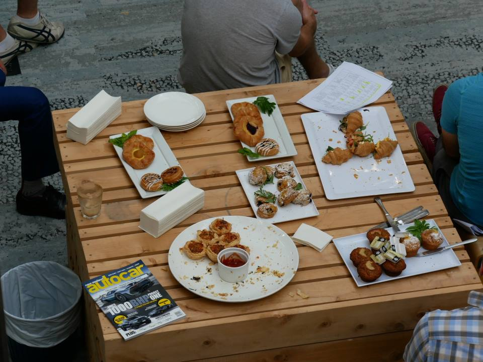
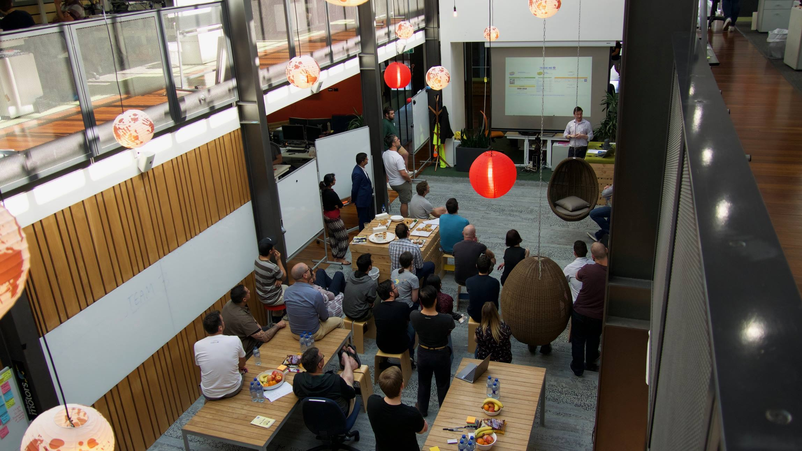
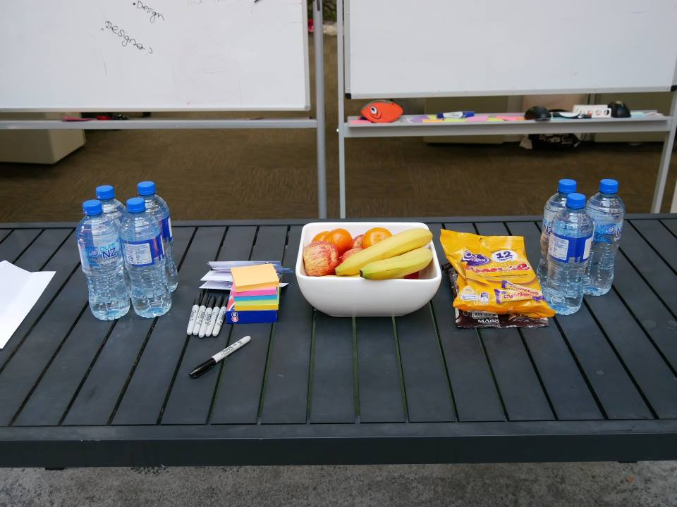
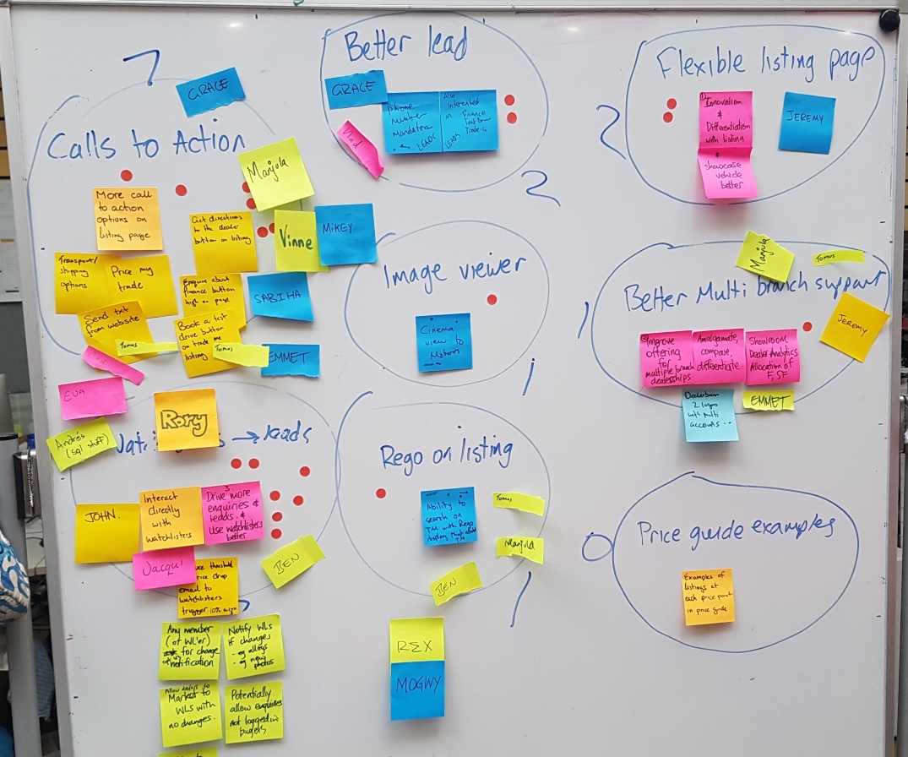
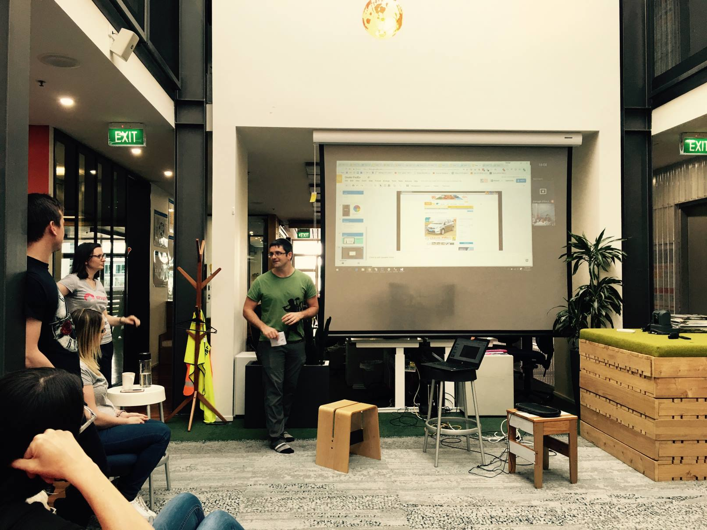

I lead a team of developers that work on one of the busiest New Zealand websites. We have ~4 million members and ~850,000 unique users every day. Working at this kind of scale means the real people who buy and use our products can get lost behind user personas or Jira ticket numbers.

To bridge the gap between my team and their customers I organised a week of hands on outstanding customer appreciation. We would invite 9 customers to join us in our office. They would meet our team, learn how we work and ask us anything they liked. We would do a discovery session directly with them and have our customers prioritize what we should work on.

For the next four days we would hack and hustle as many solutions as possible into production. I learned about the strengths of my team and some problems in our processes but we got some great stuff out to production and had some smiling customers at the end.

### The Challenge

Working this closely with your customer is very risky. We had to give a crash course in agile discovery in an hour and a half and we had to promise to deliver software solutions in four days with NO IDEA what the problems would be. If we didn’t deliver we would look and feel pretty crap.

I knew we couldn’t scale this to 4 million members but if we did it right I was sure it would completely blow away expectations for the handful of customers we did target and I hoped it would have lasting effects on our delivery culture.

“…you’ll find that delighting customers scales better than you expected. Partly because you can usually find ways to make anything scale more than you would have predicted, and partly because delighting customers will by then have permeated your culture.” – Paul Graham

### Outcomes

The outcomes I needed were split between our customers and my team.

I wanted our customers to feel…

that we care deeply about their business and their problems.
like we are competent and understand their business.
that we provide value for money.
I wanted the developers in my team to have…

increased empathy for our customers by associating their work with real people rather than personas.
a chance to hack and hustle to get shit done outside of our structured day-to-day agile practice.

### The Plan

I initially proposed a day long product discovery with our customers in our office but based on positive feedback for the idea and some fantastic input from my colleagues across all the other disciplines in our organisation – sales, marketing, account management etc. – a day long event grew to became a week-long customer workshop.

We would do 1 day of discovery with the customer on Monday, followed by 4 days of delivery with regular communications throughout the week. We would followup afterwards via email and we would meet them again in a month to check in.

### The Customer Workshop Day

This was the most important day of the entire week. Everything had to run perfectly while our customers were in our office. And we had to make sure that they felt comfortable from the moment they arrived. We poured over the details for this day for weeks. We had invited 9 customers but only 7 showed up so we made the teams a little bit smaller.

We started with breakfast and a casual introduction our team to make sure everyone was relaxed and well fed! This was a nice way for everyone to meet and it went very well. After 30 minutes everyone had met and we were on our way!

We took the customers on a tour of our office and described how our teams are comprised. We showed them how agile teams work, the size of our organisation and roles of the team members. In general they thought our office was awesome and we’re surprised how few of us there were to keep the all our apps and sites running!

We had an hour Q+A session with our head of business where we also described our strategy and how customer focused we are trying to be. It was a little bit tough to get the customers to ask what was on their mind initially but once one started the rest joined in. We got asked some TOUGH questions. It was a great experience for our customer to get frank answers and great for the delivery team to see what they are worried about.

Next we split the customers in to three groups. We paired them up with members of our delivery team and set them loose with post-it notes, whiteboards and markers. They spent the afternoon talking about our software and their business. We had each group prioritize everything they came up with and chose the top three items for us to work on.

Then we brought the 3 groups and the 9 problems together and asked them to vote again on the combined list of problems. We gave each customer three sticky dots to vote on the problems they wanted us to focus on for the week.

I wanted to do this to give our customers and idea of the prioritization and compromise we have to deal with every time we tackle a new feature for them. It’s cleat that there were two things that were most important for all customers even though each of these items came from one group.

We finished the day with some heartfelt thanks and a small gift to our customers for giving up their day to be with us.

### Four Days of Delivery

The next morning we kicked off our delivery team. This was a completely optional event so not everyone joined in. But I knew the people that did participate would be fully engaged. I also wanted the team to self select around the problems our customers identified so I purposely gave them no instructions other than “this is the stuff you need to work on”. It was a testament to the maturity of the team that they had all formed sub-teams and were idea storming in under an hour.

One challenge during the four days was breaking out of the processes in our organisation. We run lean in general so shared resources usually need more than a day or two notice to fit us in to their sprints. This meant we couldn’t deploy some prototypes in the end but it is understandable that other teams can’t change just for us:) This was possibly the best insight of the entire week for me – we have dependencies that slow us down. We need to figure out why and if it’s worth fixing.

In the end we had teams working on 5 problems. We got solutions deployed to production for four of them. This was a far better result than I could have imagined and the demo day had 8 solid prototypes and production features to show off. The solutions went across all of our platforms – multiple .Net websites, Android and iOS apps.

### Three Key Learnings

We have mature teams that can self select and solve problems with zero management interference.

We have some organisational dependencies that should be examined.

Delivering regular small ( < 2-3 hours for one developer ) customer focused quick wins is far more valuable than I expected.

Finally, My colleagues are AWESOME. I got heaps of help organizing and running this. It simply wouldn’t have been possible without their help.

### Customer Workshop Guides

We have received great feedback on the day from our customers and from other teams throughout the business. I hope this is something other organisations can try. It will get your delivery team closer to your customer and you’ll quickly figure out where the issues are in your organisation and processes.

Organizing an event like this takes weeks of planning but if you’re interested you can check out my FREE course on Teachable here:

https://fuzzyminds.teachable.com/p/the-customer-workshop/

It includes all the files, checklists and agendas. There’s some promotional material and all the hints and tips I learned from organizing this event.
